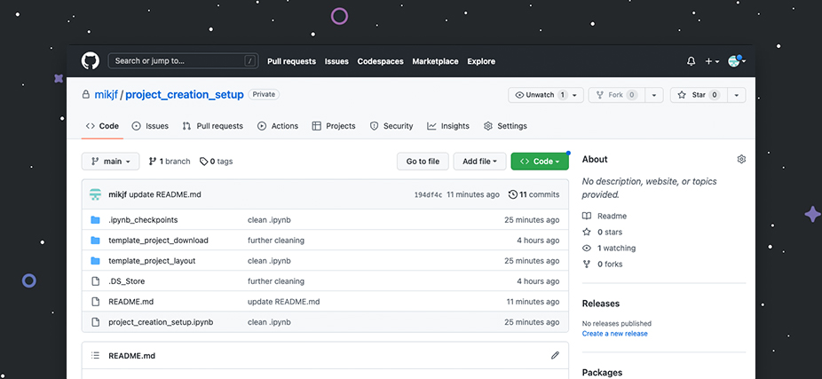

# Project Creation Setup

#### -- Project Status: [Completed]

## Objective
This very simple project aims to show a quick and easy structure to be used for simple data science projects with GitHub.

## Project development workflow
You can find the detailed repository structure, how to create a project on GitHub and a quick way to setup a dedicated conda environment in [project_creation_setup](project_creation_setup.ipynb).

### Template for new projects
* [template_project layout](project_creation_setup/template_project_layout/)
* [template_project.zip download](template_project_download/template_project.zip)

### Technologies
* GitHub
* Anaconda
* Python
